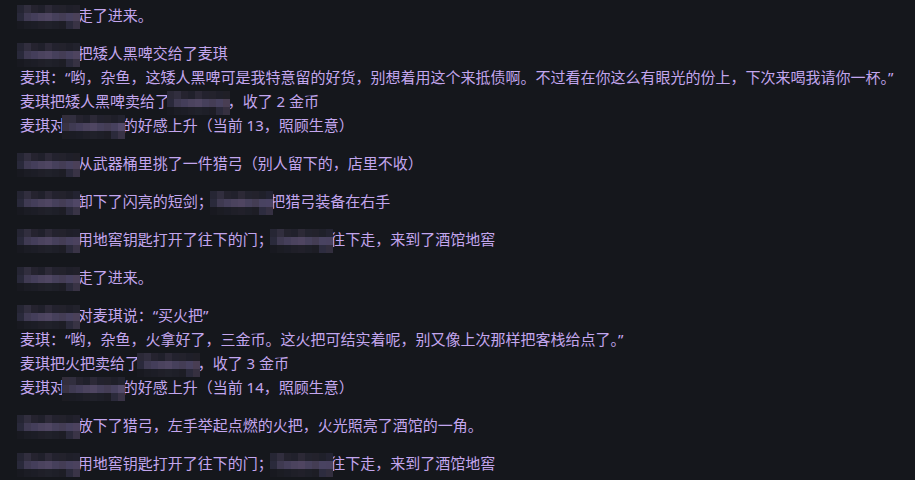
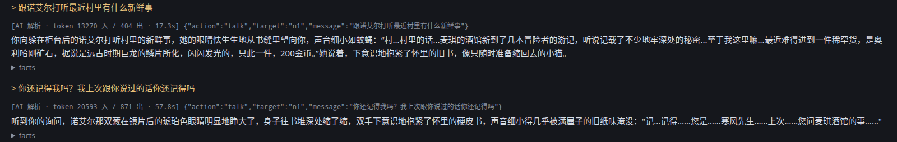
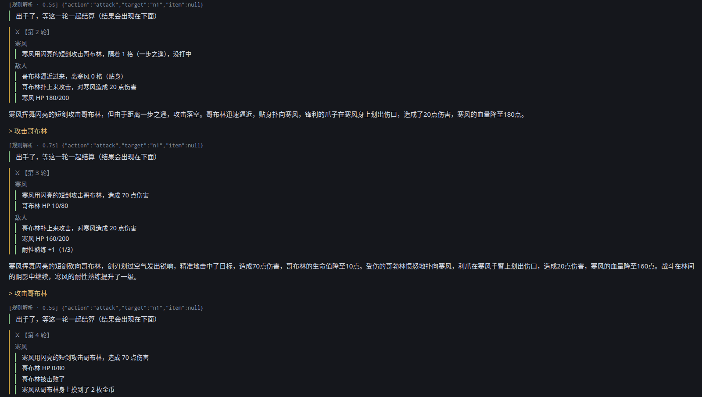
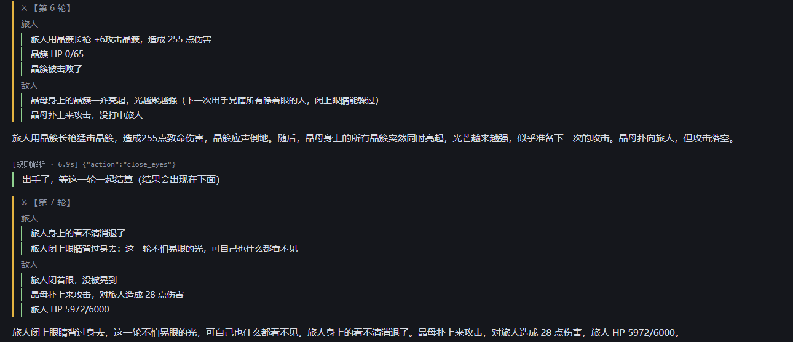

# NewEra

[](https://github.com/HFbise/NewEra/actions/workflows/tests.yml)

A multiplayer text adventure (a MUD) in the browser, where players type whatever they want in plain Chinese and an LLM narrates what happens. The difference from "ChatGPT as a dungeon master": **the model never owns the game state.** Every number, item, hit and death is decided by a rules engine written in plain code (dice included); the model only interprets what the player meant and describes what the engine says happened.

> The game itself is in Chinese. This README is in English for portfolio readers; code comments and design notes are in Chinese.

## A look at the game

Real sessions with friends. The right-hand panel, cropped here, shows stats, the room, NPC services and the minimap.



**A shared world.** Other players' actions arrive in your log as they happen. Here another player trades with Maggie, the innkeeper, who teases him in character and likes him a little more after each purchase.



**Free text in, typed actions out.** Above each narration is how the turn was parsed: by the LLM here (with its token count and the JSON action it produced), or by the hand-written rules when they're sure. Asked "do you remember me?", the shopkeeper brings up the player's earlier question about the tavern. NPC memory combines a rolling summary with past exchanges retrieved by relevance.



**The engine decides, the model describes.** A combat round: the engine settles distance, hits, damage, the kill and the loot (+2 gold) first, and the paragraph underneath only retells those facts. Turns marked 规则解析 were parsed by the rules in under a second, with no LLM call.



**Bosses you beat with choices, not just numbers.** On floor 20 the Crystal Mother telegraphs a blinding flash (round 6). The player closes their eyes (round 7), and the engine records the flash as dodged.

## Why this design

Letting an LLM run a game directly breaks quickly. It forgets an item a player picked up three turns ago, lets a clever sentence ("I swing so hard the dragon dies instantly") win a fight, and invents doors that don't exist. Multiplayer makes it worse, because two players can be told two different versions of the same room.

So the model gets two narrow jobs and no authority:

1. **Understanding:** turn free text into structured actions (`attack n2`, `stunt` with a requested damage tier and difficulty, `give i3 to n1`).
2. **Describing:** write a short narration from a list of facts the engine produced, and nothing else.

Everything in between is plain Python with row-level locks in Postgres.

## How a turn works

```
player text
   │
   ▼
1. Parse      commands.py: hand-written rules cover common phrasings (fast, free)
              ai.parse_intent: LLM fallback with structured output for everything else
   │          → list of typed actions (pydantic models in schema.py)
   ▼
2. Execute    engine.execute_all: validates every action against the database,
              rolls dice, applies damage, moves items; anything the AI asked for
              is clamped (an "instant kill" request becomes whatever the rules allow)
   │          → list of facts ("Goblin takes 31 damage, HP 189/220")
   ▼
3. Decide     ai.decide_give: separate small call: does the NPC hand something over?
              (asked before narration so the story can never promise an item
              the engine didn't move)
   ▼
4. Narrate    ai.narrate: writes 2–4 sentences from the facts only; NPC dialogue is a
              separate role-play call wrapped into the narration verbatim
```

A few things that took real iteration:

- **Facts-only narration.** Player names are swapped for placeholders before the model sees them (a player called "寒风", *cold wind*, kept getting written into the weather), and swapped back afterwards.
- **Combat rounds for groups.** In a fight, each party member's command is queued; when everyone has acted, enemies act once. Rounds that get stuck (a deploy mid-fight, a dropped connection) are closed automatically on startup and after a timeout.
- **Stealth.** Detection chance grows each action, depends on light, cover, monster perception and how many enemies are watching; sneak attacks, hiding mid-fight and "keen" monsters that can't be sneaked past.

## By the numbers

From one week of play with a small group of friends (22–30 September 2026, six players):

| | |
|---|---|
| Turns logged | ~830 |
| Turns parsed by the hand-written rules, no LLM parsing call | **56%** |
| LLM calls | 7,858 across 5 models, 21.4M input tokens |
| Median latency (p90) | parsing 2.7 s (8.1 s) · narration 4.3 s (9.1 s) · NPC line 1.8 s (7.5 s) |
| Failed LLM calls | **30%**, mostly free-tier rate limits and timeouts |
| Turns that still got a narration | **93.5%** (most of the rest are chat-only actions that skip narration by design) |
| Deepest floor reached | 41 |
| Model cost | $0, runs on free-tier GLM "flash" models |

The failure rate is the interesting line. Because the model never holds game state, a failed call can only cost a turn its prose, never its outcome: the engine has already resolved the action. A second API key, a model fallback chain and a rules-only mode cover the rest.

## What's in the game

- A small village (tavern, smithy, general store) with five NPCs who remember each player, track affinity, sell, upgrade, refine gems and react to gifts.
- A procedurally generated dungeon: each floor is a 3×3 grid with combat, treasure, event and rest rooms, a stairs guardian, teleport stones every five floors and a gate boss every 25.
- 13 dungeon themes with their own rules, including:
  - **Forge**: constant heat damage, cooled by spring water;
  - **Crystal caverns**: glare that blinds unless you close your eyes;
  - **Silent temple**: a noise meter that wakes statues and summons wanderers;
  - **Desert**: shifting exits and quicksand;
  - **Dream corridor**: drifting light and scrambled distances;
  - **Fog sea**: monsters appear at arm's length and a ferryman charges a fare;
  - **Astral expanse**: a light cycle and edges you can be knocked off.
- 60+ monsters, 35+ events, 200+ items, gems with sockets, upgrade paths, damage-over-time effects, crowd control with immunity windows, bosses with telegraphed attacks, combos and phase changes.
- Two gate bosses built around player choices rather than raw stats:
  - **Anubis**: drinking potions or dodging adds "sin" to the scales he weighs you with;
  - **Perseus**: he vanishes, flies and has to be pulled down with a rope, and petrifies anyone who doesn't close their eyes.

All game content lives in YAML under `data/` (`world.yaml`, `dungeon.yaml`, `items_dungeon.yaml`, `loot.yaml`, `deep_*.yaml`) and is loaded by the engine; adding a monster or an event is data, not code.

## Balancing with a simulator

`balance/sim.py` is a Monte Carlo model of the same rules: it plays thousands of runs through 30 floors for different builds (sword and shield, dual wield, stealth, ranged) and gear tiers, including the in-game economy (gold, upgrades, potions). Every combat change is checked against per-floor survival targets before it ships; `balance/result.md` is the current baseline. `balance/bosses.py` tunes individual bosses, and `balance/calibrate.py` compares the model against real players' logs.

## Tech

- **Backend:** Python 3.14, FastAPI, psycopg 3 (connection pool, explicit transactions, `SELECT … FOR UPDATE` where players can race)
- **Database:** Postgres on Supabase (`schema.sql`)
- **LLMs:** provider-agnostic wrapper with structured output, retries with feedback and model fallback (Zhipu GLM by default; Anthropic and Gemini supported), token and latency logging per call
- **Frontend:** a single static HTML page plus an admin panel (`static/`), no framework
- **Hosting:** Render

## Project layout

| File | What it does |
|---|---|
| `server.py` | HTTP API, turn pipeline, combat round scheduling |
| `engine/` | the rules engine, in four groups: `base/` (constants, helpers, loading, `dispatch` with the entry points), `fight/` (combat, ranged weapons, bosses, party rounds, duels, stealth, status effects, equipment), `world/` (room environment, dungeon event rooms, everyday actions, parties) and `npc/` (trade, relationships, the smith, item descriptions). Modules import each other explicitly and call across with the module name; underscore names are private to their module |
| `rules.py` | pure formulas (damage, hit chance, scaling by depth, upgrade odds), shared with the simulator |
| `dungeon.py` | floor generation, themes, spawning, loot |
| `commands.py` | rule-based parser for common commands |
| `ai.py` | all LLM calls: parsing, giving decisions, role-play, narration |
| `schema.py` / `schema.sql` | action and state models / database schema |
| `seed.py` | loads the world from `data/` into the database |
| `data/` | all game content as YAML: the village, dungeon themes, monsters, events, items, loot tables |
| `scripts/` | manual tools, e.g. a full engine walk-through against a test database (resets the world) |
| `balance/` | simulator and balance reports |
| `tests/` | tests that run without a database: formulas, dungeon generation, content cross-checks (every monster, event and item a YAML file refers to exists), the command parser and a simulator smoke test |

## Running it locally

You need Python 3.14, a Postgres database and an API key for one of the supported LLM providers.

```bash
python -m venv .venv && .venv/Scripts/activate      # or source .venv/bin/activate
pip install -r requirements.txt
cp .env.example .env                                  # fill in DATABASE_URL and an AI key
psql "$DATABASE_URL" -f schema.sql                    # create tables
python seed.py                                        # load the world (resets it)
uvicorn server:app --reload
```

Run the tests with `pytest` (no database or API key needed). Then open http://localhost:8000. Without an AI key the game still runs on the rule-based parser, with plain fact lines instead of narration.

## Status

A working prototype played by a handful of friends. It's a personal project: the code is published to show how it's built, not as a reusable library.

## License

Copyright © 2026 HFbise. All rights reserved. The source is public for viewing only; no permission is granted to use, copy, modify or distribute it. See [LICENSE](LICENSE).
